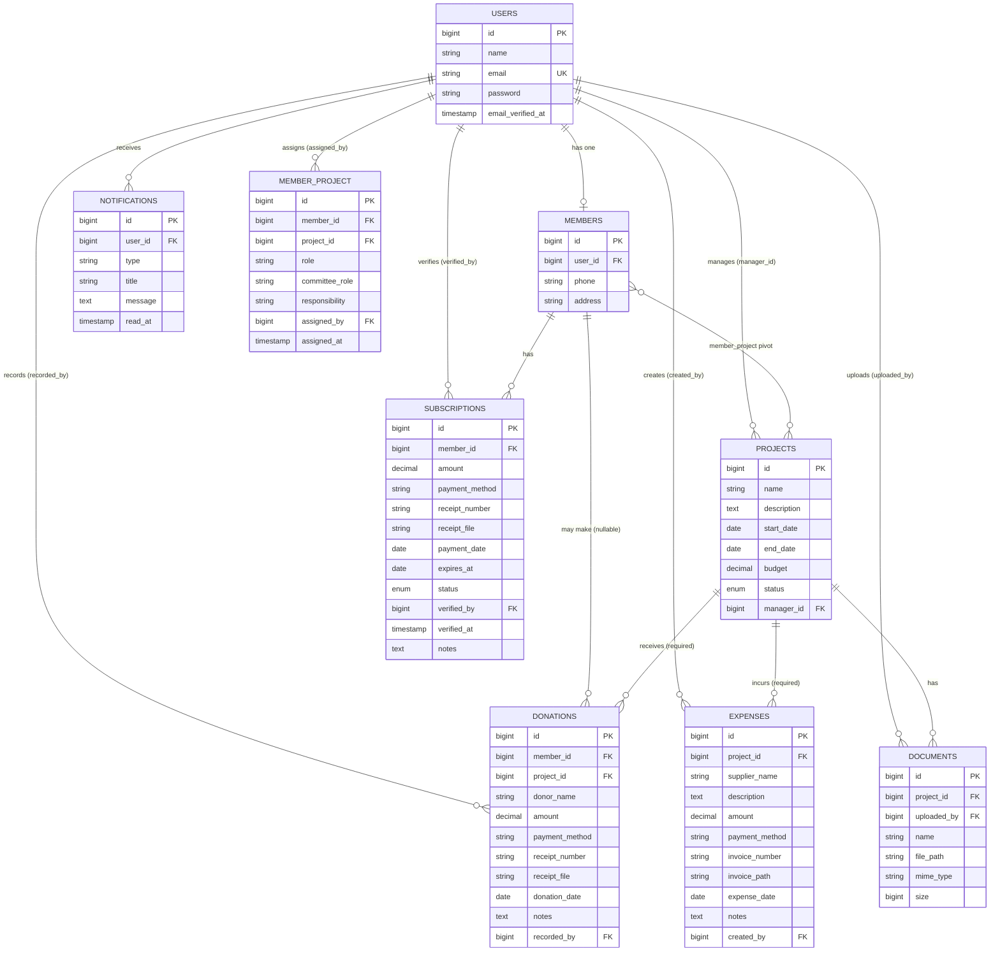

# Database Structure

MySQL, managed entirely through Laravel migrations in `database/migrations/`. This
document describes every application table, its columns, and how the tables relate —
generated directly from the migrations and Eloquent models, not from assumptions.

## Entity-Relationship Diagram

Not shown above (standard package tables, no application-specific columns):
`roles`, `permissions`, `model_has_roles`, `model_has_permissions`, `role_has_permissions`
(Spatie `laravel-permission`), `activity_log` (Spatie `laravel-activitylog`),
`personal_access_tokens` (Sanctum), plus Laravel's own `cache`, `jobs`, `sessions`,
`password_reset_tokens`.

## Tables

### `users`

Base authenticatable account. Every person in the system — president, committee
members, subscribers — is a `users` row first; `members` is a separate profile
attached to a subset of users (see below).

| Column | Type | Notes |
|---|---|---|
| `id` | bigint PK | |
| `name` | string | |
| `email` | string | unique |
| `email_verified_at` | timestamp, nullable | |
| `password` | string | hashed |
| `remember_token` | string | |
| `timestamps` | | |

Traits: `HasApiTokens` (Sanctum), `HasRoles` (Spatie — links to `roles`/`permissions`
via `model_has_roles`/`model_has_permissions`), `Notifiable`.

Relations (`app/Models/User.php`): `member()` hasOne `Member`; `managedProjects()`
hasMany `Project` (`manager_id`); `recordedDonations()` hasMany `Donation`
(`recorded_by`); `createdExpenses()` hasMany `Expense` (`created_by`);
`committeeRoleFor(Project): ?string` — reads this user's `member_project.committee_role`
for a given project.

### `members`

A member profile — created when a `user` is onboarded as an association member
(vs. just a raw account). One-to-one with `users`.

| Column | Type | Notes |
|---|---|---|
| `id` | bigint PK | |
| `user_id` | bigint FK → `users.id` | `cascadeOnDelete` |
| `phone` | string, nullable | |
| `address` | string, nullable | |
| `timestamps` | | |

Relations (`Member.php`): `user()` belongsTo `User`; `subscriptions()` hasMany
`Subscription`; `donations()` hasMany `Donation`; `projects()` belongsToMany
`Project` through `member_project`, with pivot columns `role`, `responsibility`,
`assigned_by`, `assigned_at` (not `committee_role` — see note under
`member_project` below).

Activity-logged (`LogsActivity`, fillable + dirty fields).

### `subscriptions`

Annual membership dues paid by a member. Not tied to any project — this is
general association income.

| Column | Type | Notes |
|---|---|---|
| `id` | bigint PK | |
| `member_id` | bigint FK → `members.id` | `cascadeOnDelete` |
| `amount` | decimal(10,2) | |
| `payment_method` | string | |
| `receipt_number` | string, nullable | |
| `receipt_file` | string, nullable | storage path |
| `payment_date` | date | |
| `expires_at` | date | |
| `status` | enum | `pending` \| `verified` \| `rejected` \| `expired`, default `pending` |
| `verified_by` | bigint FK → `users.id`, nullable | `nullOnDelete` |
| `verified_at` | timestamp, nullable | |
| `notes` | text, nullable | |
| `timestamps` | | |

Relations (`Subscription.php`): `member()` belongsTo `Member`; `verifier()`
belongsTo `User` (`verified_by`). Activity-logged.

### `projects`

An association initiative/project. Has its own budget, committee (via
`member_project`), donations, expenses, and documents.

| Column | Type | Notes |
|---|---|---|
| `id` | bigint PK | |
| `name` | string | |
| `description` | text, nullable | |
| `start_date` | date | |
| `end_date` | date, nullable | |
| `budget` | decimal(10,2) | default `0` |
| `status` | enum | `planned` \| `active` \| `completed` \| `cancelled`, default `planned` |
| `manager_id` | bigint FK → `users.id`, nullable | `nullOnDelete` |
| `timestamps` | | |

Relations (`Project.php`): `manager()` belongsTo `User`; `members()` belongsToMany
`Member` through `member_project`, with pivot columns `role`, `committee_role`;
`documents()` hasMany `Document`; `donations()` hasMany `Donation`; `expenses()`
hasMany `Expense`. Activity-logged.

`ProjectResource` (API response shape) computes `collected` (sum of this
project's donations), `expenses` (sum of this project's expenses), `remaining`
(`collected − expenses`), and `progress` (`collected / budget`, capped at 100%)
on the fly — these are not stored columns.

### `member_project` (pivot)

Links members to the projects they're assigned to, carrying their committee
assignment.

| Column | Type | Notes |
|---|---|---|
| `id` | bigint PK | |
| `member_id` | bigint FK → `members.id` | `cascadeOnDelete` |
| `project_id` | bigint FK → `projects.id` | `cascadeOnDelete` |
| `role` | string, nullable | legacy free-text role label |
| `committee_role` | string | `leader` \| `treasurer` \| `secretary` \| `member`, default `member` — added `2026_07_16`, this is what authorization policies actually read (`User::committeeRoleFor()`) |
| `responsibility` | string, nullable | added `2026_07_13` |
| `assigned_by` | bigint FK → `users.id`, nullable | `nullOnDelete`, added `2026_07_13` |
| `assigned_at` | timestamp, nullable | added `2026_07_13` |
| `timestamps` | | |

Two committee-role concepts coexist on this table: the original free-text `role`
column, and the later `committee_role` enum-like string that authorization
actually depends on. `Member::projects()` exposes `role`/`responsibility`/
`assigned_by`/`assigned_at` on its pivot but not `committee_role`; `Project::members()`
exposes `role`/`committee_role` but not the responsibility/assignment fields —
each relation was extended independently for what its call sites needed.

### `donations`

Money donated toward a specific project. Always project-scoped — `project_id`
was made non-nullable by a later migration (`2026_07_13_100000`), even though
the column itself remains nullable in the original `2026_07_10` migration.
`member_id` stays nullable/nullOnDelete so external (non-member) donors can be
recorded via `donor_name` alone.

| Column | Type | Notes |
|---|---|---|
| `id` | bigint PK | |
| `member_id` | bigint FK → `members.id`, nullable | `nullOnDelete` |
| `project_id` | bigint FK → `projects.id` | **required**, `cascadeOnDelete` (tightened `2026_07_13`) |
| `donor_name` | string, nullable | used when no `member_id` |
| `amount` | decimal(10,2) | |
| `payment_method` | string | |
| `receipt_number` | string, nullable | |
| `receipt_file` | string, nullable | storage path |
| `donation_date` | date | |
| `notes` | text, nullable | |
| `recorded_by` | bigint FK → `users.id`, nullable | `nullOnDelete` |
| `timestamps` | | |

Relations (`Donation.php`): `member()` belongsTo `Member`; `project()` belongsTo
`Project`; `recorder()` belongsTo `User` (`recorded_by`). Activity-logged.

### `expenses`

Money spent on a specific project. Always project-scoped (`project_id` required
from creation — no legacy nullable period, unlike `donations`).

| Column | Type | Notes |
|---|---|---|
| `id` | bigint PK | |
| `project_id` | bigint FK → `projects.id` | required, `cascadeOnDelete` |
| `supplier_name` | string | |
| `description` | text | |
| `amount` | decimal(10,2) | |
| `payment_method` | string | |
| `invoice_number` | string, nullable | |
| `invoice_path` | string, nullable | storage path |
| `expense_date` | date | |
| `notes` | text, nullable | |
| `created_by` | bigint FK → `users.id`, nullable | `nullOnDelete` |
| `timestamps` | | |

Relations (`Expense.php`): `project()` belongsTo `Project`; `creator()` belongsTo
`User` (`created_by`). Activity-logged.

### `documents`

Files attached to a project (receipts, reports, misc. project files).

| Column | Type | Notes |
|---|---|---|
| `id` | bigint PK | |
| `project_id` | bigint FK → `projects.id` | required, `cascadeOnDelete` |
| `uploaded_by` | bigint FK → `users.id` | required, `cascadeOnDelete` |
| `name` | string | |
| `file_path` | string | storage path |
| `mime_type` | string | |
| `size` | unsigned bigint | bytes |
| `timestamps` | | |

Relations (`Document.php`): `project()` belongsTo `Project`; `uploader()`
belongsTo `User` (`uploaded_by`). **Not** activity-logged (no `LogsActivity`
trait), unlike every other domain model.

### `notifications`

In-app notifications, added `2026_07_17`. Currently populated by exactly one
event path: `Notification::notifyRoles()`, called from `SubscriptionController`
when a subscription becomes `pending` (new submission or receipt re-upload),
notifying everyone holding `president`/`tresorier`/`vice-tresorier`.

| Column | Type | Notes |
|---|---|---|
| `id` | bigint PK | |
| `user_id` | bigint FK → `users.id` | `cascadeOnDelete` |
| `type` | string | e.g. `subscription_pending` |
| `title` | string | |
| `message` | text, nullable | |
| `read_at` | timestamp, nullable | null = unread |
| `timestamps` | | |

Relations (`Notification.php`): `user()` belongsTo `User`. Not activity-logged
(not a domain/business-data model).

### Spatie `laravel-permission` tables

Standard package schema (default table/column names, no `teams` mode):

- `roles` — `id`, `name`, `guard_name`. Seeded roles (`RoleSeeder`): `president`,
  `vice-president`, `tresorier`, `vice-tresorier`, `secretaire-general`,
  `vice-secretaire-general`, `conseiller`, `abonne`. Every user is also assigned
  `abonne` as a baseline.
- `permissions` — `id`, `name`, `guard_name`. Seeded permissions
  (`PermissionSeeder`): `members.*`, `subscriptions.*`, `projects.*`,
  `donations.*`, `expenses.*` (`view`/`create`/`update`/`delete`, plus
  `subscriptions.verify`).
- `model_has_roles`, `model_has_permissions` — polymorphic pivots assigning
  roles/permissions directly to `users` rows.
- `role_has_permissions` — pivot granting permissions to roles
  (`RolePermissionSeeder`).

### Spatie `laravel-activitylog` table

- `activity_log` — `log_name`, `description`, `subject` (morph: model + id),
  `event`, `causer` (morph: model + id, typically a `User`), `attribute_changes`
  (json), `properties` (json). Populated for `Member`, `Subscription`, `Project`,
  `Donation`, `Expense` (all use `LogsActivity` with `logFillable()->logOnlyDirty()`).
  `Document`, `Notification`, and `User` do not log activity.

### Sanctum `personal_access_tokens`

Standard Sanctum schema — polymorphic `tokenable` (always `User` here), hashed
`token`, `abilities`, `last_used_at`, `expires_at`.

## Relationship summary (Eloquent, not just FKs)

| From | Method | Type | To |
|---|---|---|---|
| `User` | `member()` | hasOne | `Member` |
| `User` | `managedProjects()` | hasMany | `Project` (`manager_id`) |
| `User` | `recordedDonations()` | hasMany | `Donation` (`recorded_by`) |
| `User` | `createdExpenses()` | hasMany | `Expense` (`created_by`) |
| `Member` | `user()` | belongsTo | `User` |
| `Member` | `subscriptions()` | hasMany | `Subscription` |
| `Member` | `donations()` | hasMany | `Donation` |
| `Member` | `projects()` | belongsToMany | `Project` (via `member_project`) |
| `Subscription` | `member()` | belongsTo | `Member` |
| `Subscription` | `verifier()` | belongsTo | `User` (`verified_by`) |
| `Project` | `manager()` | belongsTo | `User` (`manager_id`) |
| `Project` | `members()` | belongsToMany | `Member` (via `member_project`) |
| `Project` | `documents()` | hasMany | `Document` |
| `Project` | `donations()` | hasMany | `Donation` |
| `Project` | `expenses()` | hasMany | `Expense` |
| `Donation` | `member()` | belongsTo | `Member`, nullable |
| `Donation` | `project()` | belongsTo | `Project`, required |
| `Donation` | `recorder()` | belongsTo | `User` (`recorded_by`) |
| `Expense` | `project()` | belongsTo | `Project`, required |
| `Expense` | `creator()` | belongsTo | `User` (`created_by`) |
| `Document` | `project()` | belongsTo | `Project` |
| `Document` | `uploader()` | belongsTo | `User` (`uploaded_by`) |
| `Notification` | `user()` | belongsTo | `User` |

## Key structural notes

- **Subscriptions are association-wide; donations and expenses are always
  project-scoped.** There is no "general" donation or expense — every donation
  and expense row has a `project_id`. This is why the Finance page's "Available
  Funds" is defined purely from subscription totals: donations/expenses already
  belong to a project's own books.
- **`member_project` carries two overlapping role concepts** (`role` free text,
  `committee_role` structured) because `committee_role` was added later
  (`2026_07_16`) on top of an existing pivot, rather than replacing `role`.
  Authorization (`ProjectPolicy`, `DonationPolicy`, `ExpensePolicy`, via
  `User::committeeRoleFor()`) reads `committee_role` only.
  - **Note:** this project uses the same `member_project.committee_role` values
    (`leader`/`treasurer`/`secretary`/`member`) in the backend migration comment
    and `User::committeeRoleFor()`, but `frontend/src/lib/roles.js`'s
    `isCommitteeTreasurer()` checks for `'treasurer'` while `DonationPolicy`/
    `ExpensePolicy::create()` check `['leader', 'treasurer']` — consistent. No
    mismatch found, called out here only because it's worth double-checking if
    committee-role strings are ever changed.
- **A `User` is not necessarily a `Member`.** `member()` is nullable — a user can
  hold a Spatie role (e.g. `president`) without ever having a `members` row.
  Several authorization helpers (`User::committeeRoleFor()`,
  `AuthorizationHelper::hasProjectAssignments()`) explicitly guard against a
  null `member`.
- **Soft business-rule enforcement, not DB constraints**: `budget`, `amount`
  fields are plain `decimal(10,2)` with no `CHECK` constraint — non-negative
  values are enforced at the FormRequest validation layer
  (`min:0`), not the database.
- **No `expenses`/`donations` general-ledger or transfer table.** The Finance
  page's "transfer funds to a project" feature works by directly incrementing
  `projects.budget` via the existing project update endpoint — there is no
  separate ledger/transaction table recording the transfer event itself (beyond
  whatever `activity_log` captures as a `budget` field change on `Project`).
